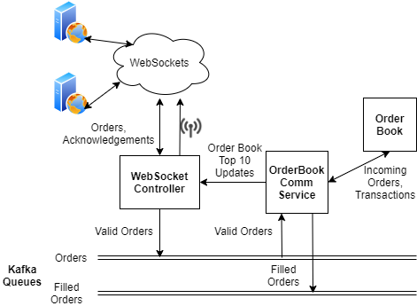

# WebSocketStockExchange

### Intro
This is a basic Stock Exchange service enabling users to place orders and view a live-updating Top 10 list of buy/sell orders
Implemented with Kafka messaging queues for order persistence and WebSockets for handling client connections. Includes a simple user interface.

__(This was completed over the course of a week for an interview challenge in 2020)__

### Build and Run instructions:
1)  [Install Gradle](https://spring.io/guides/gs/gradle/#initial)  
2)  [Install Apache Kafka (Tested with version 2.5.0)](https://kafka.apache.org/quickstart)  
3)  Download all the files and cd into directory
4)  Run `gradlew build -x test` (gradle can be built with tests after running once, due to auto-creation of kafka topics)  
5)  Run `gradlew run`    
6)  Access client UI (default is [localhost:8081](http://localhost:8081) but can be changed in application.yml)

### Demo

https://user-images.githubusercontent.com/19828773/163876053-82c802a8-c5d4-4d98-bcb9-81e4262f6178.mp4

### Architecture:
  
(best visible in light theme)  
